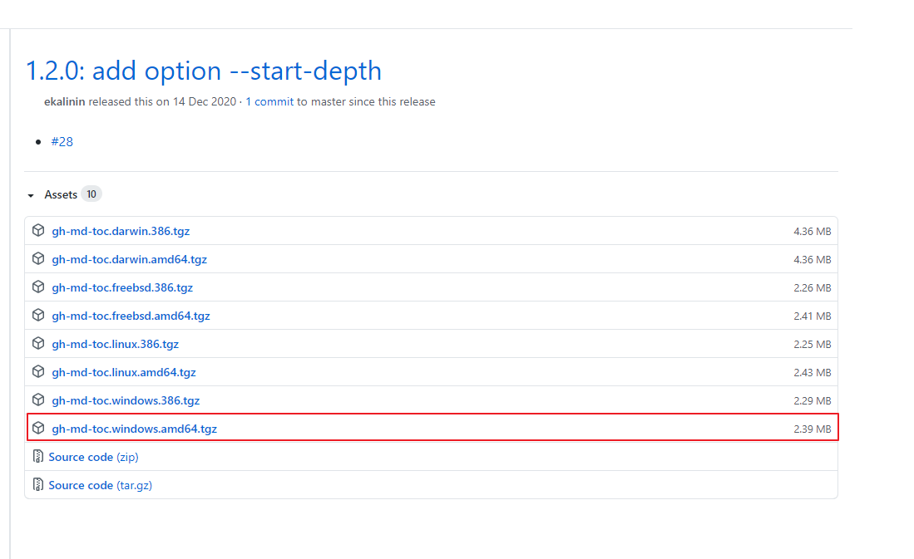
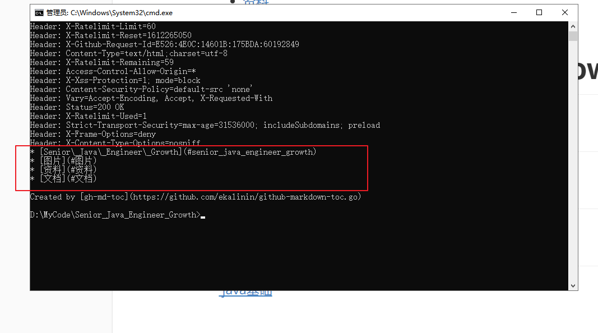

[下载地址](https://github.com/ekalinin/github-markdown-toc.go/releases)

1、下载后解压

2、解压后是一个没有后缀名的文件，需要改成.exe后缀文件

3、将 gh-md-toc.exe 这个文件放在readme.md同路径下

4、打开 gh-md-toc.exe

5、在当前目录打开cmd

6、在readme.md设置好目录

7、在cmd中执行 gh-md-toc.exe README.md

8、将红色方框内的内容复制到readme.md文档的最上面

9、提交到github打开就可以看到了